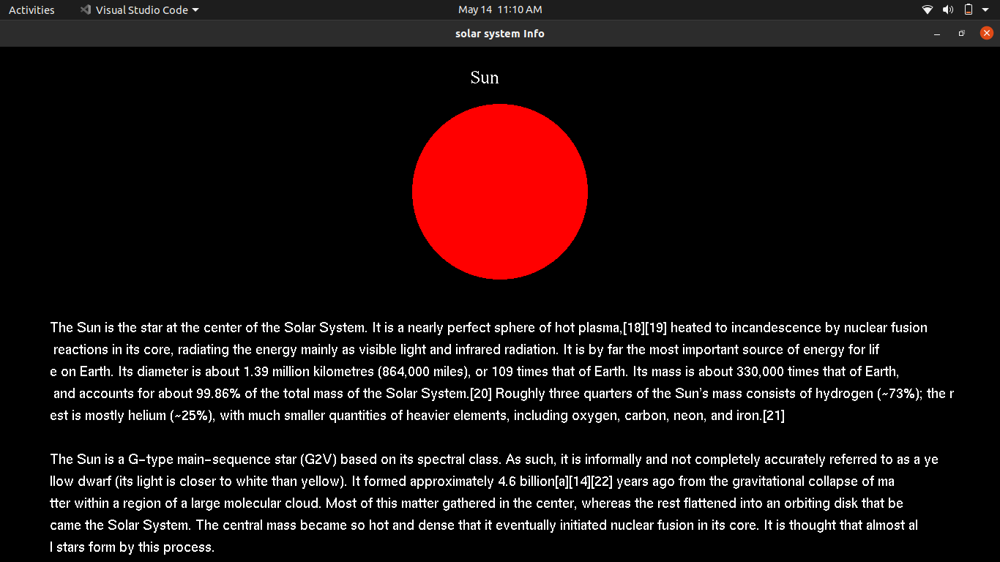

##                                                                     Solar system

The project “Solar System Simulation” is meant as a source of recreation where one can sit in front of the computer and have the vision of a planet in space. This package is developed to provide a visualization of the solar system in a simple 2D manner. It is aimed to create stars and planets and celestial bodies and give constant motion to these objects. 

The sun and its family of eight planets are imagined to be placed in a background of bright twinkling stars along with a comet in constant motion. The most important aspect of this project is that, one can sit back, relax and watch constantly occurring motion of the planet and the stars just depicting the fact that “as passengers of the earth, our voyage never ends!” 
##                                                                      ScreenShots

